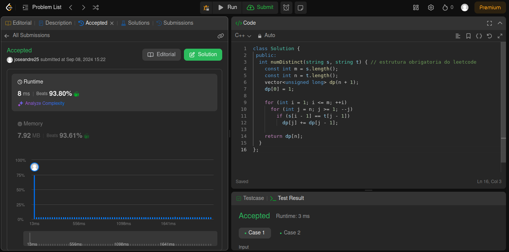
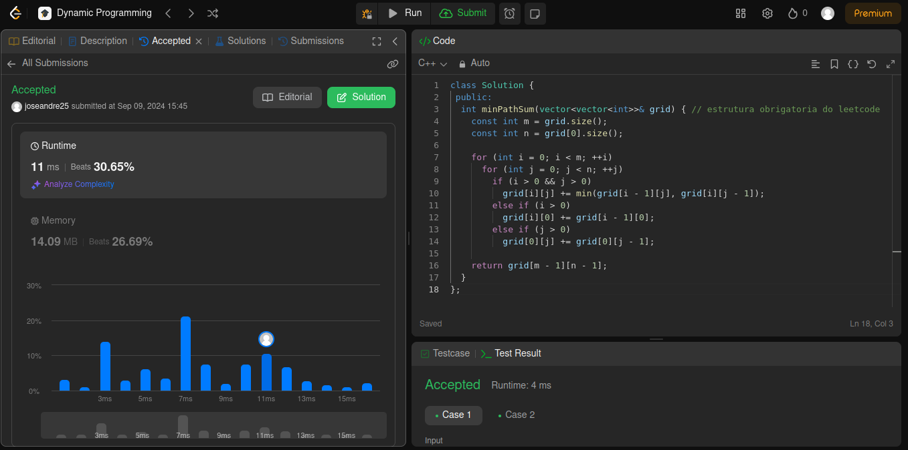

# Questões - Juíz Online

**Número da Lista**: X<br>
**Conteúdo da Disciplina**: Programação Dinâmica<br>

## Alunos

| Matrícula  | Aluno                               |
| ---------- | ----------------------------------- |
| 21/1062016 | José André Rabelo Rocha |
| 20/0020323 | Jefferson Sena Oliveira         |

## Apresentação
A apresentação pode ser vista no YouTube por meio do link: 

## Sobre

Este projeto consiste na realização de exercícios de plataformas de juízes eletrônicos. Serão desenvolvidos problemas de média e alta
complexidade com ênfase nos conteúdos vistos no módulo de Programação Dinâmica. 

## Questões

| Nome                                                                                                                                        | Nível   |
| ------------------------------------------------------------------------------------------------------------------------------------------- | ------- |
| [115. Distinct Subsequences](https://leetcode.com/problems/distinct-subsequences/?envType=problem-list-v2&envId=dynamic-programming)                                                 | Difícil |
| [64. Minimum Path Sum](https://leetcode.com/problems/minimum-path-sum/description/?envType=problem-list-v2&envId=dynamic-programming)     | Médio   |
|  [10. Regular Expression Matching](https://leetcode.com/problems/regular-expression-matching/description/?envType=problem-list-v2&envId=dynamic-programming)    |  Difícil  |


## Screenshots

#### Exercício 01 - Distinct Subsequences

Dificuldade: Difícil <br>
Descrição do Problema: [115. Distinct Subsequences](https://leetcode.com/problems/distinct-subsequences/?envType=problem-list-v2&envId=dynamic-programming)  <br>
Solução Proposta: [Código de Solução](https://github.com/projeto-de-algoritmos-2024/ProgramacaoDinamica_Questoes_JuizOnline/blob/master/Distinct%20Subsequences/distinct_subsequences.cpp)  



#### Exercício 02 - Minimum Path Sum

Dificuldade: Média <br>
Descrição do Problema: [64. Minimum Path Sum](https://leetcode.com/problems/minimum-path-sum/description/?envType=problem-list-v2&envId=dynamic-programming) <br>
Solução Proposta: [Código de Solução](https://github.com/projeto-de-algoritmos-2024/ProgramacaoDinamica_Questoes_JuizOnline/blob/master/Minimum%20Path%20Sum/minimum_path_sum.cpp)  



#### Exercício 03 - Regular Expression Matching

Dificuldade:  Difícil<br>
Descrição do Problema: [10. Regular Expression Matching](https://leetcode.com/problems/regular-expression-matching/description/?envType=problem-list-v2&envId=dynamic-programming) <br>
Solução Proposta: [Código da Solução](https://github.com/projeto-de-algoritmos-2024/ProgramacaoDinamica_Questoes_JuizOnline/blob/master/RegularExpressionMatching/regular_expression_matching.py)


## Instalação

**Linguagem**: C++ <br>
<!-- **Framework**: (caso exista)<br> -->
Descreva os pré-requisitos para rodar o seu projeto e os comandos necessários.

## Uso

Instruções para compilar e executar o código C++:

1. Certifique-se de ter um compilador para C e C++ instalado em sua máquina. Recomendamos o gcc.

2. Faça o clone do repositório Git para o seu ambiente local.

3. No terminal, navegue até o diretório onde está localizado o arquivo de código-fonte (.cpp ou .c) que deseja compilar.

4. - Compile o arquivo de código-fonte utilizando o seguinte comando:
```g++ <nome-do-arquivo.cpp> -o <nome-do-executavel> ```
Substitua <nome-do-executavel> pelo nome desejado para o executável e <nome-do-arquivo.cpp> pelo nome do arquivo de código-fonte.
    - Para a execução em C: Compile o arquivo de código-fonte utilizando o seguinte comando:
```gcc <nome-do-arquivo.c> -o <nome-do-executavel> ```
Substitua <nome-do-executavel> pelo nome desejado para o executável e <nome-do-arquivo.cpp> pelo nome do arquivo de código-fonte.

5. Após a compilação bem-sucedida, execute o programa com o seguinte comando:
```./<nome-do-executavel>```
Certifique-se de estar no diretório correto em seu terminal para executar o programa.

6. Opcional: Deixamos arquivos de entrada para casos de teste (por exemplo, in.txt). Assim, você pode redirecionar a entrada para o programa durante a execução. Por exemplo:
```./<nome-do-executavel> < <nome-do-arquivo-de-input>.txt```

### Executar os exercícios em python

Para executar os arquivos localmente, siga os passos abaixo:

1. Clone o repositório para seu ambiente local

2. Navegue até o diretório do projeto

3. Certifique-se de ter o python 3 instalado.

4. Execute o exercício 3:

    ```bash
    python3 RegularExpressionMatching/regular_expression_matching.py
   ```


<!--## Outros

Quaisquer outras informações sobre seu projeto podem ser descritas abaixo.

-->
